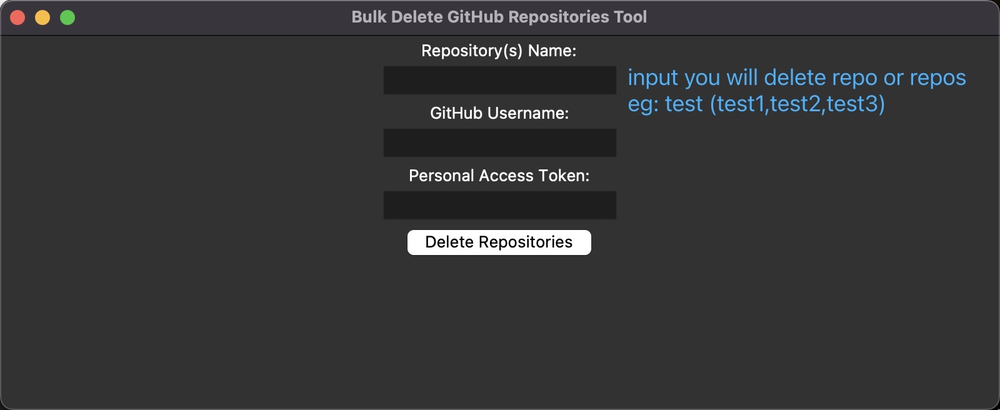
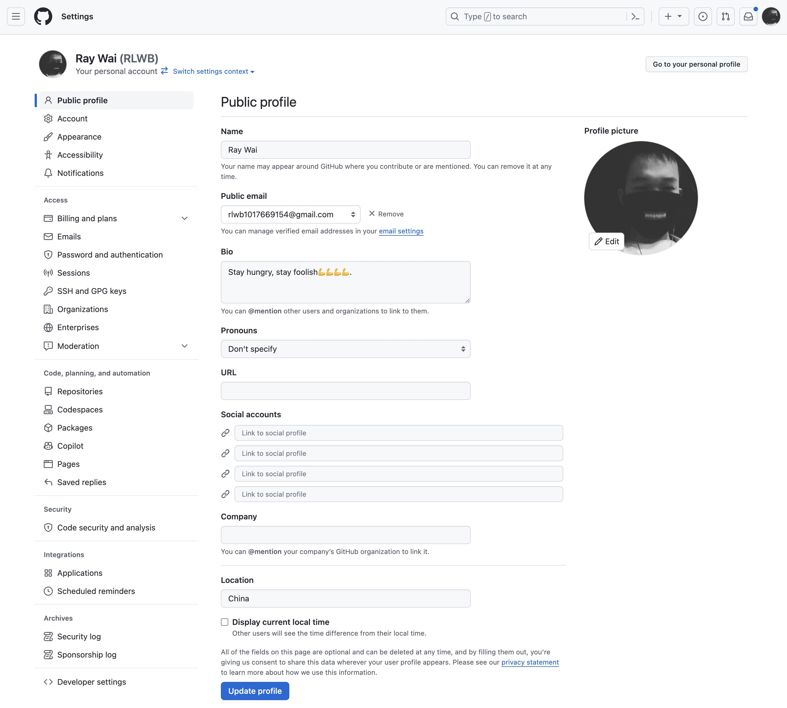
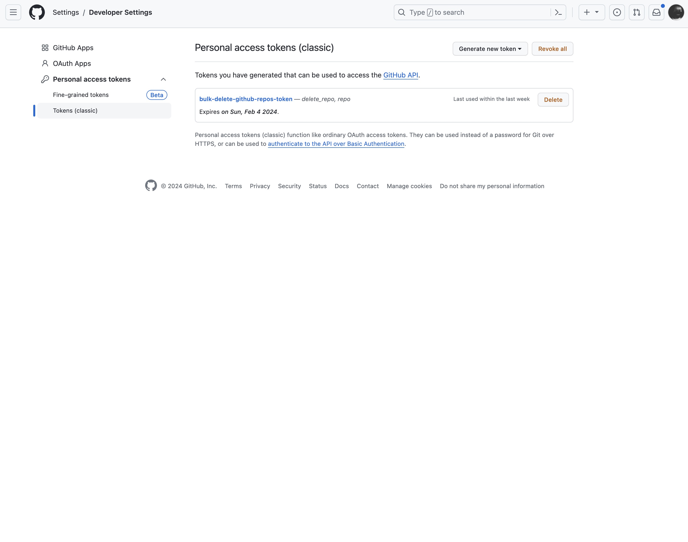

# bulk-delete-github-repos

A tools for githuber to delete repos in batches.

## Start Command

```python
python main.py
```
## Usage



**_NOTE:_**  How to get personal access token

1.open GitHub [setting](https://github.com/settings/profile) page


2.open `Developer settings`, choose `Personal access tokens` -> `Tokens` ->click `Generate new token` to generate token.

